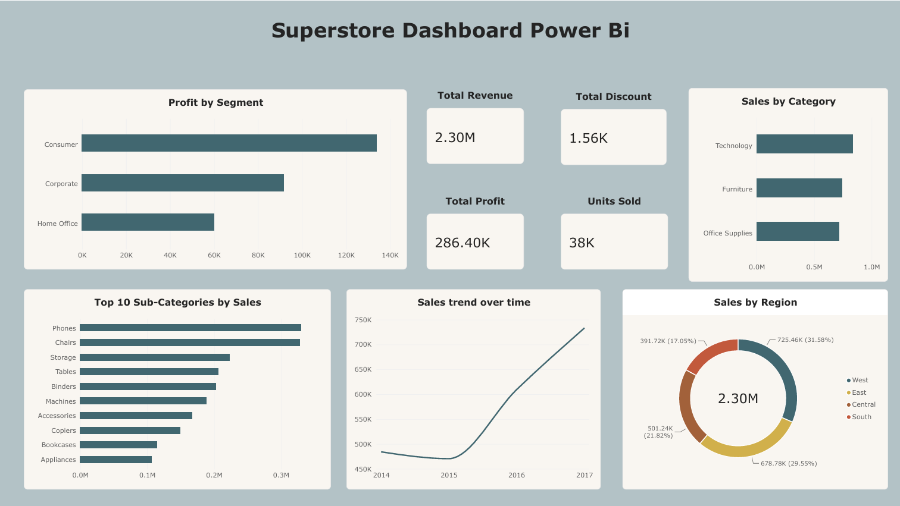

# Superstore Sales Dashboard - Power BI
## Power BI Dashboard Project

## 📌 Overview
An interactive business intelligence dashboard analyzing Superstore sales data including revenue, profit, regional performance and product category insights built using Microsoft Power BI.

## 📊 Dashboard Visuals
1. **Total Revenue** - 2.30M KPI Card
2. **Total Profit** - 286.40K KPI Card
3. **Units Sold** - 38K KPI Card
4. **Total Discount** - 1.56K KPI Card
5. **Profit by Segment** - Consumer, Corporate, Home Office comparison
6. **Sales by Category** - Technology, Furniture, Office Supplies
7. **Top 10 Sub-Categories by Sales** - Phones leading
8. **Sales Trend over Time** - 2014 to 2017 growth
9. **Sales by Region** - West, East, Central, South breakdown

## 🔍 Key Insights
- **Total Revenue of 2.30M** with a profit of 286.40K
- **Technology** is the highest selling category
- **West region** leads with 31.58% of total sales
- **Consumer segment** generates the highest profit
- **Phones** are the top selling sub-category
- Clear **upward sales trend** from 2014 to 2017

## 🛠️ Tools Used
- Microsoft Power BI Desktop
- Power Query for data transformation

## 📁 Dataset
- Dataset: Sample Superstore Dataset
- Source: [Kaggle - Superstore Dataset](https://www.kaggle.com/datasets/vivek468/superstore-dataset-final)
- 9,994 records of US retail sales data

## 🖼️ Dashboard Preview

## ▶️ How to Use
1. Download `Superstore.pbix`
2. Open in Power BI Desktop
3. Explore the interactive dashboard

## 👤 Author
**Muhammad Abdul Rehman**
BS Data Science - UET Lahore
